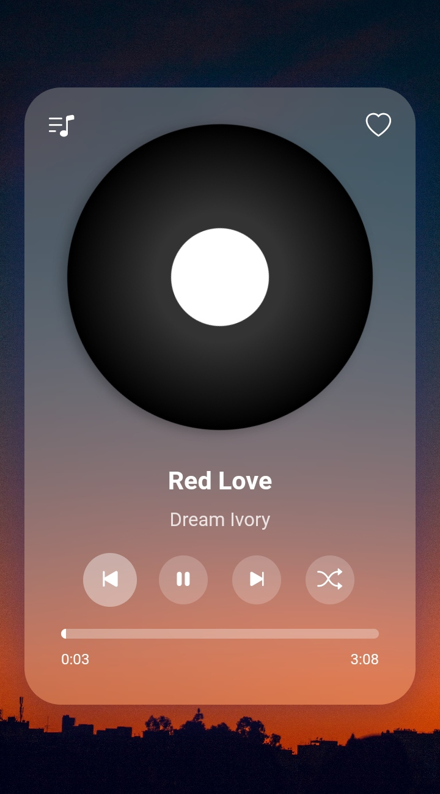

# Music Player

## Description
Music Player is a stylish and functional web application for playing music. It provides a user-friendly interface with essential music playback features such as play, pause, next, previous, shuffle, and repeat. Enjoy your favorite tunes with ease!

## Features
- Play, pause, next, and previous track controls
- Shuffle and repeat modes for playlist management
- Display of current song title, artist name, and album cover
- Progress bar indicating playback position and duration
- Favorite button to mark songs as favorites
- Playlist toggle for easy access to song list

## Screenshot


## Installation
1. Clone the repository:
    ```bash
    git clone https://github.com/JohnDev19/enhanced-music-player.git
    ```
2. Navigate to the project directory:
    ```bash
    cd enhanced-music-player
    ```
3. Open `index.html` in your preferred web browser.

## Usage
1. Click on the play button to start playback of the current song.
2. Use the next and previous buttons to navigate through the playlist.
3. Toggle shuffle mode to randomize playback order.
4. Toggle repeat mode to repeat the current song or playlist.
5. Click on the heart icon to add or remove a song from favorites.
6. View song details including title, artist, and progress.

## Contributing
We welcome contributions to Enhanced Music Player! If you would like to contribute, please follow these steps:
1. Fork the repository.
2. Create a new branch (`git checkout -b feature-branch`).
3. Make your changes and commit them (`git commit -am 'Add new feature'`).
4. Push to the branch (`git push origin feature-branch`).
5. Create a new Pull Request.

## License
This project is licensed under the MIT License.
